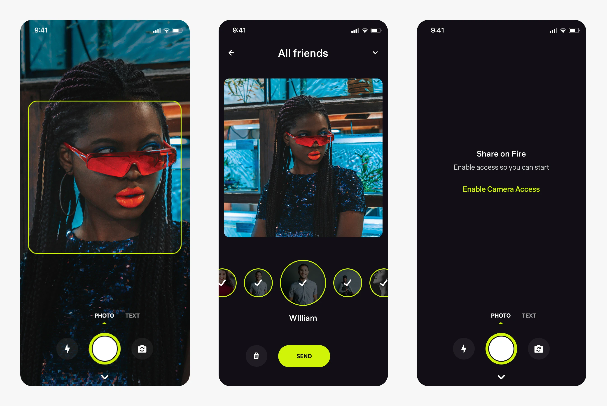
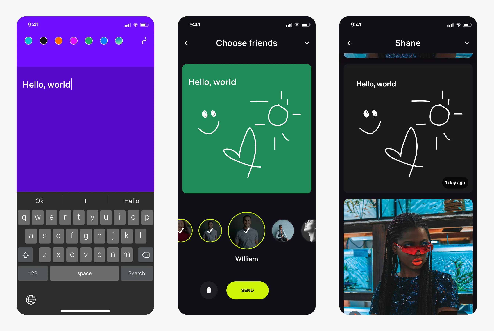
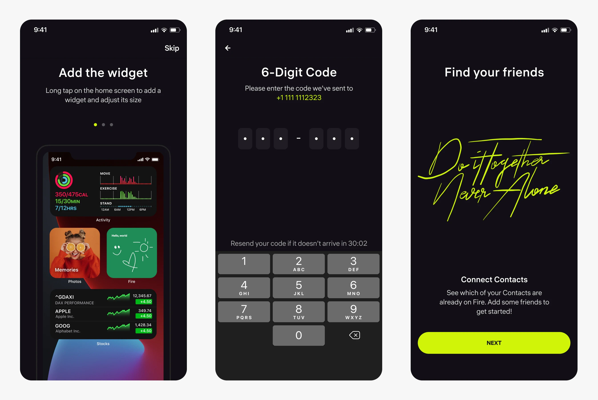

    

**Fire** – mobile application that offers users a private space to maintain connections with loved ones, even over long distances. It facilitates sharing of photos and text messages, ensuring a secure and intimate platform for staying in touch.

P.S. This is a prototype application developed at Apple Developer Academy.

